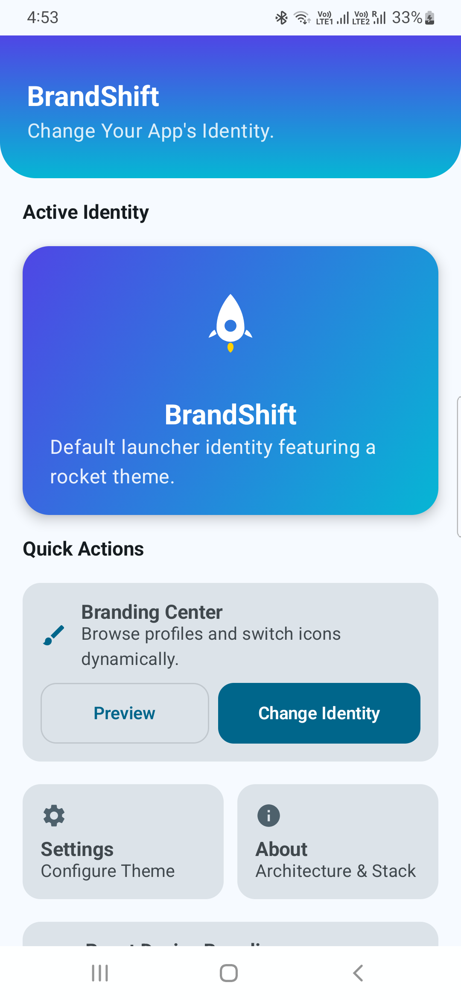
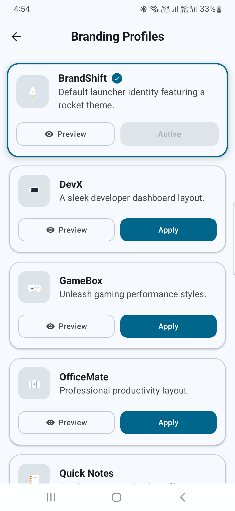
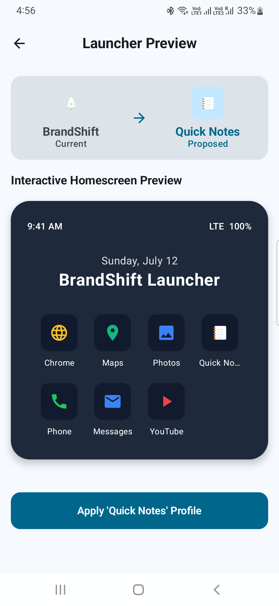
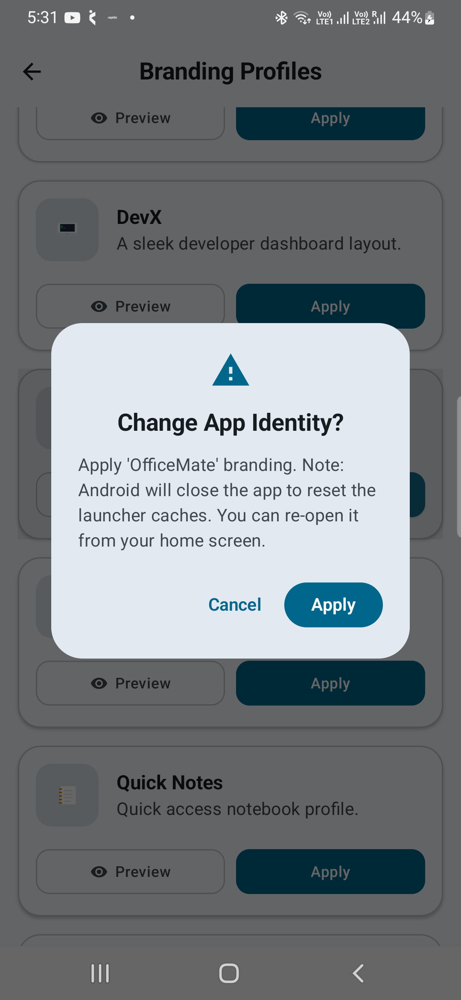
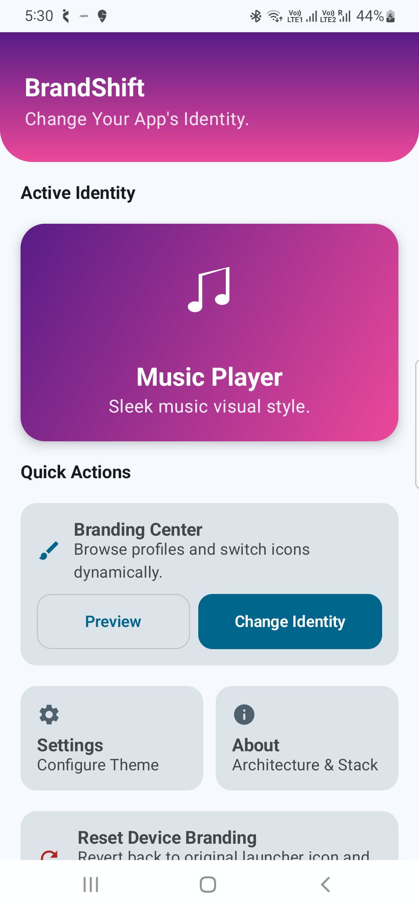
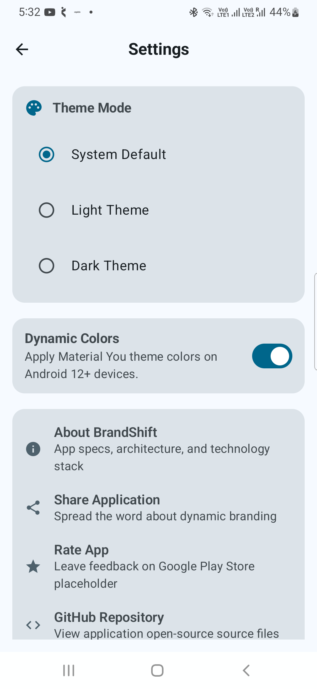
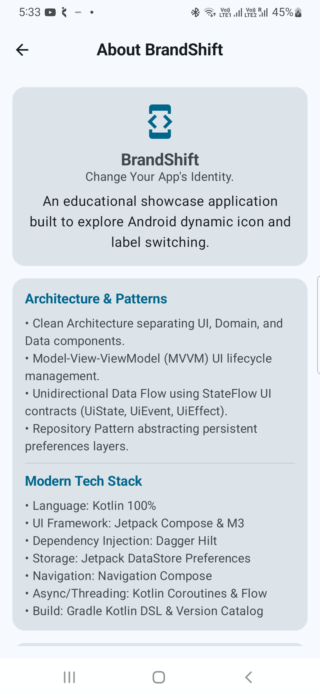
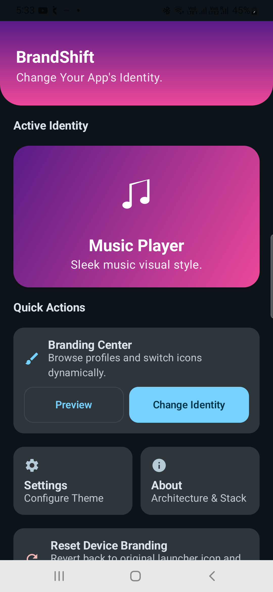
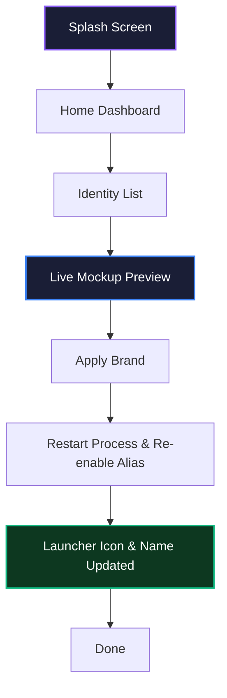

<p align="center">
  
</p>

<h1 align="center">BrandShift</h1>

<p align="center">
  <strong>Transform Your App's Identity</strong><br />
  A modern, production-grade showcase Android application demonstrating dynamic launcher icon and launcher app name switching on the fly using Android Activity Aliases.
</p>

<p align="center">
  <a href="https://developer.android.com"></a>
  <a href="https://kotlinlang.org"></a>
  <a href="https://developer.android.com/jetpack/compose"></a>
  <a href="https://m3.material.io"></a>
</p>

<p align="center">
  
  
  
</p>

<p align="center">
  
  
  <a href="https://android-arsenal.com/api?level=24"></a>
  <a href="LICENSE"></a>
</p>

<p align="center">
  <a href="https://github.com/aneez197/BrandShift/stargazers"></a>
  <a href="https://github.com/aneez197/BrandShift/commits/main"></a>
  <a href="https://github.com/aneez197/BrandShift/releases"></a>
</p>

---

## 🎨 Project Banner


---

## 🎥 Demo Video

### Product Launch Showcase

Click the thumbnail below to watch the premium vertical showcase video outlining the launch details, screen transitions, and branding switches in action.

<p align="center">
  <a href="assets/demo.mp4">
    
  </a>
</p>

<!-- <p align="center">
  <strong>▶ <a href="assets/demo.mp4">Watch Vertical Trailer (MP4 Format)</a></strong> &nbsp;&bull;&nbsp; <strong>📺 <a href="https://youtube.com/placeholder">Watch on YouTube (Alternative Link)</a></strong>
</p> -->

---

## 📱 Screenshots

### Interactive Gallery

| Home Dashboard | Brand Identities Selection |
|:---:|:---:|
|  |  |

| Mockup Live Preview | Applying Brand Identity |
|:---:|:---:|
|  |  |

| Launcher Icon Updated | App Settings |
|:---:|:---:|
|  |  |

| Architecture & Specifications | Dark Mode Experience |
|:---:|:---:|
|  |  |

---

## 🔄 Application Flow

The diagram below maps the navigation path from initial launch through checking details, picking brand variations, previewing configurations, and applying launcher alias changes.

```
[ Splash Screen ]
       ↓
[ Home Dashboard (Current Profile) ]
       ↓
[ Identity List Grid (Select Alternative Profiles) ]
       ↓
[ Live Phone Mockup Preview ]
       ↓
[ Confirm / Apply (Trigger Component Switches & Process Recycle) ]
       ↓
[ Launcher Refreshes (Desktop Icon & Label Updates) ]
       ↓
[ Done ]
```

### Flowchart Representation (Mermaid)



---

## ✨ Features

- **🚀 Dynamic Launcher Icon**: Seamlessly swap launcher shortcuts directly from inside the app drawer or home screen grid.
- **🏷️ Dynamic Launcher Name**: Instantly update desktop app label names associated with the active launcher profiles.
- **🔗 Activity Alias Architecture**: Built-in declaration of eight distinct `<activity-alias>` configurations mapped to the same entry point.
- **📱 Mock Launcher Preview**: Cycle through profiles on a simulated, interactive, animated desktop mockup beforehand.
- **📦 Persistent Identity Settings**: Integrates Jetpack DataStore to maintain theme configuration selection across process cycles.
- **🎨 Material 3 & Jetpack Compose**: Full support for adaptive themes, dynamic custom spacing, Material You color mapping, and sleek dark modes.
- **✨ Fluid Micro-Animations**: Interactive, spring-damped transitions, animated list layouts, and glowing vector layouts.
- **🏗️ Deep Clean Architecture**: Decoupled domain models, isolated business logic usecases, and robust repository abstractions.

---

## 🛠️ Tech Stack

| Layer | Technology | Description |
|---|---|---|
| **Language** | Kotlin | Modern, concise, and type-safe language. |
| **UI Framework** | Jetpack Compose | Declarative toolkit for modern Android UI. |
| **Design System** | Material Design 3 | Google's premier color, typography, and component system. |
| **Architecture** | MVVM + Clean Architecture | Structured layer isolation (Presentation, Domain, Data). |
| **Storage** | Jetpack DataStore | Modern, asynchronous key-value data caching. |
| **Dependency Injection** | Dagger Hilt | Simplified, compiler-checked dependency graphs. |
| **Asynchronous Logic** | Coroutines & StateFlow | Cold/hot streams handling asynchronous state processing. |
| **Navigation** | Compose Navigation | Declarative type-safe screen routing. |
| **Testing** | JUnit & Mockito | Modular verification scripts ensuring engine stability. |

---

## 📂 Project Structure

```
BrandShift/
├── app/                  # Main Android application module
│   └── src/main/
│       ├── java/com/aneez/brandshift/
│       │   ├── core/     # Core modules: designsystem, datastore, dispatchers, utils
│       │   ├── feature/  # Screens: splash, home, identities, preview, settings, about
│       │   ├── domain/   # Business logic: domain models, repository contracts, usecases
│       │   ├── data/     # Data layers: datasources, repository implementations
│       │   └── di/       # Dagger Hilt dependency modules
│       └── res/          # XML adaptive drawables, layouts, and assets
├── screenshots/          # Gallery assets for README documentation
├── assets/               # Banner graphics and vertical demo trailers
└── README.md             # Repository documentation
```

---

## 🏗️ Architecture

BrandShift strictly adheres to Android development best practices by combining the **Model-View-ViewModel (MVVM)** pattern with **Clean Architecture** principles.

```
       +-----------------------+
       |   Presentation (UI)   |
       |  (Compose, ViewModel) |
       +-----------+-----------+
                   |
                   v
       +-----------------------+
       |     Domain Layer      |
       |  (UseCases, Models)   |
       +-----------+-----------+
                   |
                   | (via Repository Interface)
                   v
       +-----------------------+
       |      Data Layer       |
       | (Repository, DataSrc) |
       +-----------+-----------+
         /                   \
        v                     v
+---------------+     +--------------------+
|   DataStore   |     | PackageManager API |
| (Persistence) |     |  (Activity Alias)  |
+---------------+     +--------------------+
```

### Components Breakdown:
- **Presentation Layer**: Implements pure Kotlin ViewModels communicating screen states to Declarative Compose Screens via standard `StateFlow`.
- **Domain Layer**: Contains business use cases (`ApplyIdentityUseCase`, `GetCurrentIdentityUseCase`, `GetIdentitiesUseCase`) isolating platform-specific dependencies from presentation states.
- **Data Layer**: Houses repository implementations reading preferences caching via **Jetpack DataStore** and toggling activity components via **PackageManager API**.

---

## ⚙️ How It Works

Launcher icon updates on Android require toggling standard **Activity Aliases** registered in the application manifest. 

### 1. Manifest Alias Declarations
The `AndroidManifest.xml` defines a default base activity (`MainActivity`) without any launcher intent filter, alongside eight distinct `<activity-alias>` configurations:

```xml
<activity
    android:name=".MainActivity"
    android:exported="true"
    android:theme="@style/Theme.BrandShift.NoActionBar" />

<!-- Rocket Profile (Default Enabled) -->
<activity-alias
    android:name=".MainActivityAliasBrandShift"
    android:enabled="true"
    android:exported="true"
    android:icon="@drawable/ic_launcher_brandshift"
    android:label="@string/app_name"
    android:targetActivity=".MainActivity">
    <intent-filter>
        <action android:name="android.intent.action.MAIN" />
        <category android:name="android.intent.category.LAUNCHER" />
    </intent-filter>
</activity-alias>

<!-- DevX Profile (Stealth/Developer UI) -->
<activity-alias
    android:name=".MainActivityAliasDevX"
    android:enabled="false"
    android:exported="true"
    android:icon="@drawable/ic_launcher_devx"
    android:label="DevX"
    android:targetActivity=".MainActivity">
    <intent-filter>
        <action android:name="android.intent.action.MAIN" />
        <category android:name="android.intent.category.LAUNCHER" />
    </intent-filter>
</activity-alias>
```

### 2. Component Enabling logic
When a target identity is applied, we utilize the `PackageManager` API to set component states. To prevent duplicates, we enable the target alias and disable the other seven:

```kotlin
fun toggleLauncherAlias(context: Context, activeAliasName: String, allAliases: List<String>) {
    val pm = context.packageManager
    
    // Enable active alias
    pm.setComponentEnabledSetting(
        ComponentName(context.packageName, activeAliasName),
        PackageManager.COMPONENT_ENABLED_STATE_ENABLED,
        PackageManager.DONT_KILL_APP
    )
    
    // Disable remaining aliases
    allAliases.filter { it != activeAliasName }.forEach { alias ->
        pm.setComponentEnabledSetting(
            ComponentName(context.packageName, alias),
            PackageManager.COMPONENT_ENABLED_STATE_DISABLED,
            PackageManager.DONT_KILL_APP
        )
    }
}
```

### 3. Immediate Refresh Mechanics
Android restarts the active application process automatically whenever an alias component configuration updates to reload resources. BrandShift handles this safely:
1. Shows a warning Dialog explaining the launcher refresh behavior.
2. Saves selection to **Jetpack DataStore**.
3. Programmatically triggers the `PackageManager` toggle.
4. Kills the PID using `Process.killProcess(Process.myPid())` to force the system launcher to flush its shortcut cache and reload immediately.

---

## 📥 Installation

Follow these steps to run BrandShift locally:

1. **Clone the repository:**
   ```bash
   git clone https://github.com/aneez197/BrandShift.git
   ```
2. **Open the Project:**
   - Launch **Android Studio (Ladybug or newer)**.
   - Select `Open` and navigate to the cloned project folder.
3. **Gradle Sync & SDK Check:**
   - Wait for the build files and Gradle dependencies catalog to sync automatically.
   - Ensure you have **Android SDK 34 (API Level 34)** or higher installed.
4. **Deploy & Play:**
   - Connect an Emulator or physical Android device (API Level 24+).
   - Press the **Run** button (`Shift + F10`) to build the debug APK.

---

## 🚀 Usage Guide

Discover how to cycle and toggle identities in under a minute:

1. **Open BrandShift**: The home dashboard displays your currently active launcher profile.
2. **Select Identity**: Navigate to the Identity List tab to scroll through the 8 custom profiles.
3. **Mock Launcher Preview**: Click any profile to view how the application icon and launcher title look on a simulated 3D phone mockup.
4. **Apply Changes**: Tap the **Apply** button, confirm the launcher restart prompt, and let the application close.
5. **View Desktop Update**: Return to your home screen; the launcher shortcut refreshes instantly to your selected brand profile!

---

## 🗺️ Screenshots by Flow

<details>
<summary>📸 Step 1: Dashboard Navigation</summary>

### View Active Profiles
Upon launch, view your current name, rocket icon identity, theme, and code definitions details.
<p align="left">
  
</p>
</details>

<details>
<summary>📸 Step 2: Choose Alternative Brand</summary>

### Browse Brand Profiles Grid
Select from 8 different identities including DevX, GameBox, Camera Hide Mode, Music Player, and OfficeMate.
<p align="left">
  
</p>
</details>

<details>
<summary>📸 Step 3: Screen Simulation Preview</summary>

### Live Device Preview
Simulate how the app looks on a home screen grid inside a beautiful smartphone mockup before saving changes.
<p align="left">
  
</p>
</details>

<!-- <details>
<summary>📸 Step 4: Toggle & Apply Component Settings</summary>

### Warning & Process Kill
Approve the warning dialogue, permitting dynamic package updates. The app resets to apply manifest changes.
<p align="left">
  
</p>
</details> -->

<details>
<summary>📸 Step 4: Verify Home Screen Refresh</summary>

### Instant Launcher Updates
Your application name and icon updates on the home screen without reinstallation!
<p align="left">
  
</p>
</details>

---

## 🗺️ Roadmap

- [x] Dynamic launcher icon switching engine
- [x] Programmatic dynamic app label text updates
- [x] Modern Material 3 UI Layouts
- [x] Complete Jetpack Compose design components
- [x] Dynamic theme matches & Dark Mode
- [x] Smartphone Live Mockup Preview tab
- [ ] Integration with custom user-supplied PNG/SVG icon packs
- [ ] Direct custom launcher profiles builder
- [ ] Desktop layout interactive preview Widgets
- [ ] Quick Settings Tile for instant brand shifts
- [ ] Programmable Dynamic App Shortcuts support
- [ ] Local configurations Backup & Restore
- [ ] Firebase cloud sync for profile styles
- [ ] Wear OS paired smartwatch companion app integration
- [ ] Foldables & Tablet split-screen UI layout optimizations
- [ ] Complete localization translation packages (ES, DE, FR, JA)

---

## 🔮 Future Improvements

BrandShift aims to become the definitive educational guide for Android customization APIs. The future vision includes building a sandbox launcher engine allowing developers to upload vector adaptive icons dynamically via user space folders and creating deep integrations with Material You themes so that system launchers map colors dynamically to matching app shortcuts.

---

## ⚠️ Known Android Limitations

Developing with Activity Aliases requires accounting for specific Android OS characteristics:
- **Process Kill Requirement**: Changing component enablement status forces the OS to halt the active task process (`Process.killProcess(Process.myPid()`) to flush intent registries.
- **OEM Launcher Caching**: Certain launchers (e.g. Samsung One UI, Xiaomi MIUI) aggressively cache drawer shortcuts, causing a 5-10s delay or requiring the user to navigate out/in of the home screen to refresh.
- **Icon Rearrangement**: On select older Android versions (API < 26), disabling an active alias removes its grid icon, requiring users to drag the new alias icon from the app drawer back to their home screen grid.

---

## 🤝 Contributing

Contributions are highly appreciated! Please follow these guidelines:

1. **Fork** the Repository.
2. Create a feature branch (`git checkout -b feature/amazing-feature`).
3. Commit your changes (`git commit -m 'Add amazing feature'`).
4. **Push** to the branch (`git push origin feature/amazing-feature`).
5. Open a **Pull Request** against the `main` branch.

---

## 👨‍💻 Developed By

<p align="left">
  <strong>Aneez A</strong><br />
  Android Developer & System Architect<br />
  <a href="https://github.com/aneez197"></a>
  <a href="https://www.linkedin.com/in/aneez-ayyappan-a6a537a8/"></a>
</p>

<!-- * 🌐 **Portfolio**: [aneez.dev (placeholder)](https://aneez.dev) -->
* 📧 **Email**: [aneez197@gmail.com](mailto:aneez197@gmail.com)

---

## 💖 Support the Project

If you find BrandShift useful or educational, please consider:
- ⭐ **Starring** this repository to show visibility.
- 🍴 **Forking** the codebase to experiment with custom profiles.
- 🐞 Opening an **Issue** if you discover OEM or API bugs.
- 💡 Submitting a **Feature Request** for widgets or shortcut tools.
- 📢 Sharing this repository with fellow Android engineers!

<p align="center">
  <strong>⭐ Star this repository if you found it useful! ⭐</strong>
</p>

---

## 📄 License

This project is licensed under the **MIT License** - see the [LICENSE](LICENSE) file for details.

---

<p align="center">
  Made with ❤️ using Kotlin & Jetpack Compose.<br />
  <strong>Happy Coding 🚀</strong>
</p>
